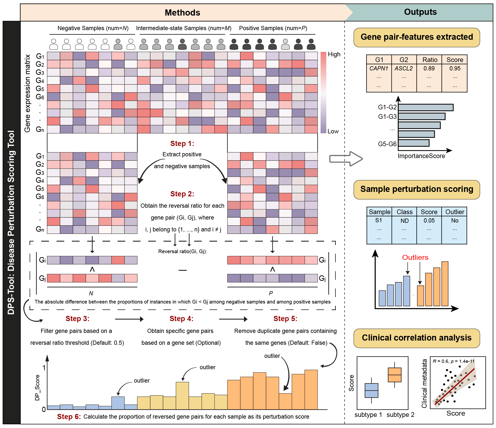

# DPS-Tool

## An online service platform for disease perturbation scoring
DPS-Tool is a bioinformatics tool designed to quantify the **disease perturbation level** of samples by analyzing gene expression patterns between positive and negative samples, while providing intuitive visualizations to help researchers understand the perturbation patterns under disease conditions.

### Key Features

- **Multi-scenario assessment**  
  Evaluate perturbation levels across different stages, subtypes, or data sources of the same disease, and compare perturbations among distinct diseases.

- **Outlier detection**  
  Automatically flags outlier samples, reducing noise and boosting downstream-analysis reliability.

- **Key gene-pair signatures**  
  Identifies robust gene-pair features that effectively discriminate positive from negative samples, facilitating diagnosis and classification studies.

- **Gene-set & clinical integration**  
  Supports perturbation analysis of disease-related gene sets and correlates perturbation scores with clinical metadata.

- **Cross-platform robustness**  
  Designed to be resilient to batch effects, enabling seamless integration of data from heterogeneous platforms and sources.

### 📁 Project Structure

| **Path** | **Description** |
|----------|------------------|
| `css/` | Global stylesheets for the entire site. |
| `dps_tool/` | Contains only `DPS-Tool.py`, the core Python script for the DPS-Tool. |
| `example/` | Sample input files together with their expected output. |
| `images/` | Static assets such as logos, screenshots, and example figures. |
| `js/` | Front-end JavaScript files for interactive functionality. |
| `README.md` | Project overview (this document). |
| `check_status.php` | Lightweight polling endpoint that returns real-time job progress. |
| `error.html` | Unified error page with common troubleshooting tips. |
| `example.html` | Quick demo page showing sample output. |
| `help.html` | Comprehensive help page explaining input formats and result interpretation. |
| `index.html` | Landing page featuring an interactive run portal and concise project overview. |
| `result.php` | Result-display API; returns interactive plots and download links for a given job ID. |
| `run.html` | Task-submission interface for uploading new datasets. |
| `upload.php` | Upload handler that performs file validation, renaming, and so on. |
| `waiting.php` | Waiting page; auto-redirects to results once ready. |
